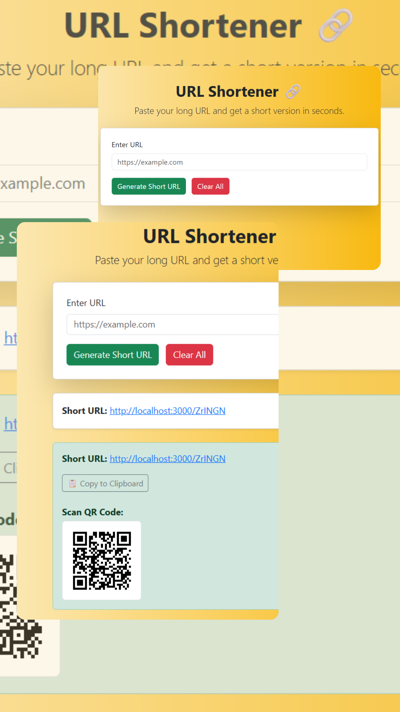

# 🔗 URL Shortener

A simple and fast **URL Shortener** service built using **Node.js**, **Express**, and **MongoDB Atlas**. Easily shorten long URLs and generate QR codes for quick sharing.

---

## 🚀 Live Demo

Check out the deployed version here:  
🌐 [https://url-shortner-production-7cd8.up.railway.app](https://url-shortner-production-7cd8.up.railway.app)

---

## 📸 Screenshot



---

## ✨ Features

- 🔗 Generate short URLs for any valid long URL
- ↪️ Redirect short URLs to original destinations
- 📷 QR code generation for each short URL
- 🧠 Unique ID generation using `nanoid`
- 🗃 Persistent data storage using MongoDB Atlas
- 🧩 RESTful API support

---

## ⚙️ Tech Stack

- **Node.js**
- **Express.js**
- **MongoDB Atlas**
- **Mongoose**
- **nanoid**
- **qrcode**

---

## 🛠️ Installation

```bash
# Clone the repository
git clone https://github.com/mayu615/URL-Shortner.git
cd URL-Shortner

# Install dependencies
npm install

# Create a .env file and add your MongoDB URI
MONGO_URI=your_mongodb_atlas_uri

# Start the server
npm start


📄 License
This project is for learning and demonstration purposes only.

🙋‍♀️ Created by @mayu615